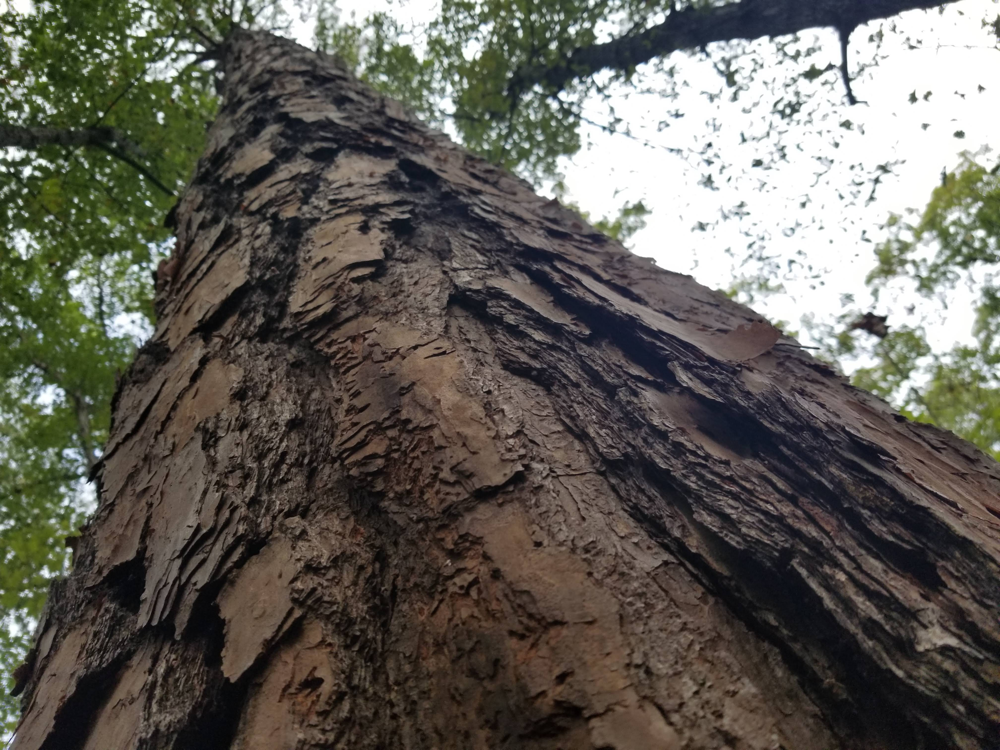

<!-- # ricardomoracastano.github.io
Ricardo Mora Castano, email: ricardomora1@yahoo.com
Repository includes website add all the files necessary to run correctly. 
Steps to Clone repository. First, I create a folder called "Github Clone a repository" (inside ricardomoracastano.github.io, I copy the ricardo project folder files inside the previous folder) in my laptop. Then open the Github desktop, in “file” menu, select “clone respository...”
the select in “local path” the folder "Github Clone a repository" in my laptop.
Then click Clone.
After that.
Now back in Mozilla firefox I go to the URL: https://github.com/ricardomoracastano/ricardomoracastano.github.io
I select repositories, inside repositories , then click over “ricardomoracastano.github.io”
Then I scroll down over “Add file”, and select Upload files, thenI add the files and folder in “drag files here to add them to your repository or choose your files”
ricardomoracastano/ricardomoracastano.github.io

This is the github.io URL:
https://ricardomoracastano.github.io/

Github repositories URL:
https://github.com/ricardomoracastano

Complete URL for ricardo project:
https://github.com/ricardomoracastano/ricardomoracastano.github.io
-->

<!doctype html>
<!--[if lt IE 7]> <html class="ie6 oldie"> <![endif]-->
<!--[if IE 7]>    <html class="ie7 oldie"> <![endif]-->
<!--[if IE 8]>    <html class="ie8 oldie"> <![endif]-->
<html lang="en">
<!--<![endif]-->

<head>
  <!--[if gt IE 8]><!--> <!-- ricardomoracastano, CTI110-0001
 Author: Ricardo Mora
 Date: July 2023
-->
  <meta name="keywords"
        content="Ricardo, Mora, Cyber, Security, computers, it, ai">

  <meta charset="utf-8">
  <meta name="keywords"
        content="it, ai, computers, radio, ricardo, mora, cyber, security, cybersecurity, width=device-width, initial-scale=1">
  <title>Home</title>
  <link href="boilerplate.css"
        rel="stylesheet"
        type="text/css">
  <link href="su_styles.css"
        rel="stylesheet"
        type="text/css">
  
  <!-- 
To learn more about the conditional comments around the html tags at the top of the file:
paulirish.com/2008/conditional-stylesheets-vs-css-hacks-answer-neither/

Do the following if you're using your customized build of modernizr (http://www.modernizr.com/):
* insert the link to your js here
* remove the link below to the html5shiv
* add the "no-js" class to the html tags at the top
* you can also remove the link to respond.min.js if you included the MQ Polyfill in your modernizr build 
-->
  <!--[if lt IE 9]>

<![endif]-->
  
  <meta name="description"
        content="RM Solutions helps on the creation of a website, in this website you will find several topics of the creation of a website and different topics that people interested in AI, ChatGPT, and other topics, come and join us in this journey, you will have the opportunity to interact with us and learn.">
</head>

<body>
  

    

      

        

          <nav>
            
<a href="homericardo.html"> Home</a> - <a href="about_us.html">About Us</a> - <a
                 href="blogricardo.html">Blog</a> - <a href="contact_usricardo.html">Contact Us</a> - <a
                 href="activitiesricardo.html">Activities at Wake Tech</a>

          </nav>

          
<em style="text-align: justify; font-style: normal; font-size: large;">“Welcome to the real world”
              The creation of a website is a challenge, in this website you will find several topics of the creation of
              a website and different topics that people interested in AI, ChatGPT, and other topics, come and join us
              in this journey, you will have the opportunity to interact with us and learn.
            </em>

          
&nbsp;

          <h2><em>These are some questions to ask when you are designing your website:
            </em></h2>
          <h2
              id="30-quot-denial-is-the-most-predictable-of-all-human-responses-quot-x2013-the-architect-the-matrix-reloaded-xa0">&nbsp;
            

          </h2>
          <ul>
            <li>
              
What are your company's core values?

            </li>
            <li>
              
What is the specific purpose of your website?

            </li>
            <li>
              
What can visitors do on the website and what can visitors see on the website?

            </li>
            <li>
              
&nbsp; Who is your audience? 

            </li>
            <li>
              
What images or videos do you want for your website?

            </li>

          </ul>
          
&nbsp;You will learn several topics and make a lot of tutorials and examples that will help you.

          
And you will grow as a person, and as a profesional!&nbsp;

          
&nbsp;

          
          
 
             
          

          
&nbsp;

        

      

    

  

</body>

</html>
